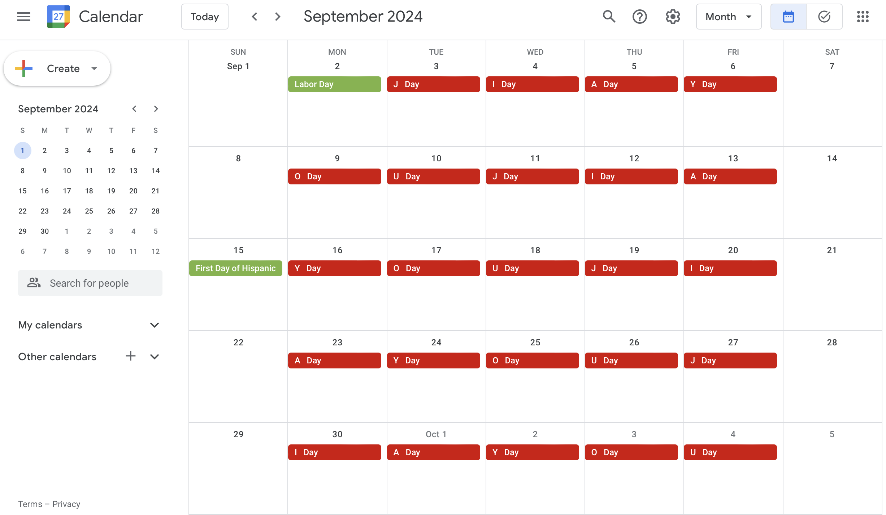

# Delete 加油 ("jiā yóu") Events

Google Apps Script for batch deleting events. Modify as needed.

```
WARNING: Deleted events are not recoverable!
```

## Visual Example

<br>Events on only "J Day's" were deleted. (See [here](https://github.com/saegl5/jiayou_update_events) how the events appeared before deleting them.)

## Getting Started

1. Go to [Google Apps Script](https://script.google.com/), and create a new project.
2. Copy and paste [the script](./Code.gs) into the editor.
3. Modify the calendar name. (By default, it is "JIA YOU." Recommended, if you had created or updated events on an alternate calender. ***Must name it differently from the owner name, otherwise the script will not delete events.***)
4. Modify the search query. (By default, it is "Updated Meeting." Specifically, `myNewQuery = "Updated Meeting";`)
5. Save and run the script. (Requires permission to make changes to events and authorization. ***Note also that deleting calendar events may be subject to a [use limit](https://support.google.com/a/answer/2905486?hl=en).***)

### Web App

To deploy the project as a web app, please consult the [development branch](https://github.com/saegl5/jiayou_delete_events/tree/development).

<hr>
Made with &heartsuit; in Visual Studio Code