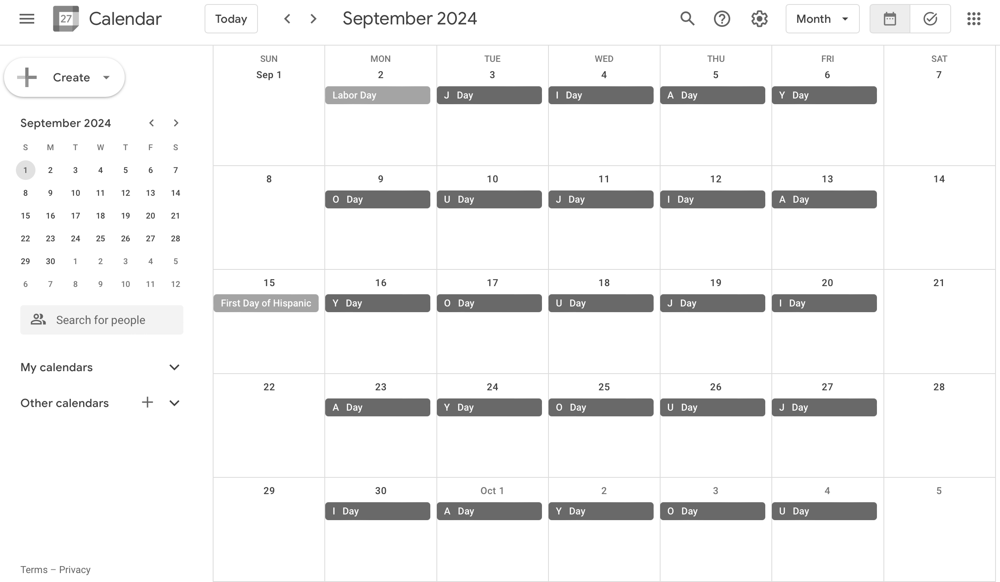

# Delete 加油 ("jiā yóu") Events

Google Web app for batch deleting events on only certain letter days (e.g., on only "J Day's"). Modify as needed, and back up your calendars before you run the app. These events are not recurring events, so without a batch script one would need to delete these events manually.

```
WARNING: Deleted events are not recoverable!
```

## Visual Example

<br>Form for deleting "JIA YOU" events.

<br>Events on only "J Day's" were deleted. (See [here](https://github.com/saegl5/jiayou_update_events) how the events appeared before deleting them.)

## Getting Started

1. Go to [Google Apps Script](https://script.google.com/), and create a new project.
2. Copy and paste [the script](./Code.gs) into the editor, and save the file.
3. Run the script to acquire authorization.
4. Create an HTML file, and name it "Index."
5. Copy and paste [the markup text](./Index.html) into the editor, and save the file.
6. Deploy the project as a Web app, and open the assigned URL.
7. Modify the calendar name and search query. (Modifying the calendar name is recommended, if you had created or updated events on an alternate calender. **_Must name the calendar differently from the owner name, otherwise the app will not delete events._**)
8. Input an alternate calendar name, if you had created events on one. (**_Same naming convention applies._**)
9. Confine the search by inputting an additional query.
10. Confine the date range by inputting a start date and end date.
11. Optionally perform a dry run to test the Web app before running it in production. Consult logs for output.
12. Press submit. (Requires permission to make changes to events and another authorization. **_Note also that deleting calendar events may be subject to a [use limit](https://support.google.com/a/answer/2905486?hl=en)._**)

<hr>
Made with &heartsuit; in Visual Studio Code
