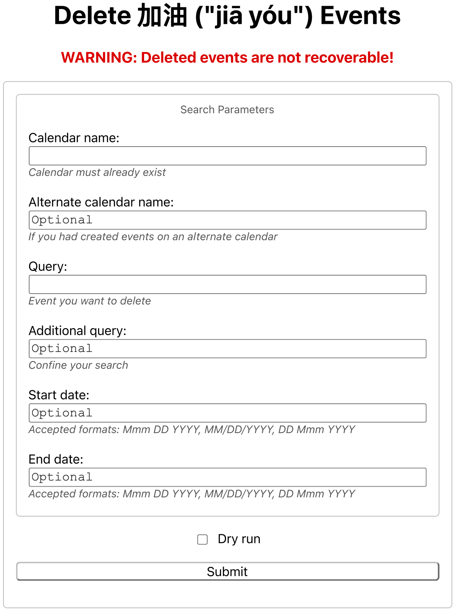

# Delete 加油 ("jiā yóu") Events

Google Apps Script for batch deleting events on only certain letter days (e.g., on only "J Day's"). Modify as needed, and back up your calendars before you run the script. These events are not recurring events, so without a batch script one would need to delete these events manually.

```
WARNING: Deleted events are not recoverable!
```

## Visual Example

<br>Form for deleting "JIA YOU" events.

<br>Events on only "J Day's" were deleted. (See [here](https://github.com/saegl5/jiayou_update_events) how the events appeared before deleting them.)

## Getting Started

1. Go to [Google Apps Script](https://script.google.com/), and create a new project.
2. Copy and paste [the script](./Code.gs) into the editor, and save the file.
3. Create an HTML file, and name it "Index."
4. Copy and paste [the markup text](./Index.html) into the editor, and save the file.
5. Deploy the project as a Web app, and open the assigned URL.
6. Modify the calendar name and search query. (Recommended, if you had created or updated events on an alternate calender. ***Must name the calendar differently from the owner name, otherwise the script will not delete events.***)
7. Press submit. (Requires permission to make changes to events and authorization. ***Note also that deleting calendar events may be subject to a [use limit](https://support.google.com/a/answer/2905486?hl=en).***)

## Known Issue

Deploying the project as a Web app should, but does not always, grant the app authorization. You may need to run the script manually, then re-open the assigned URL.

<hr>
Made with &heartsuit; in Visual Studio Code